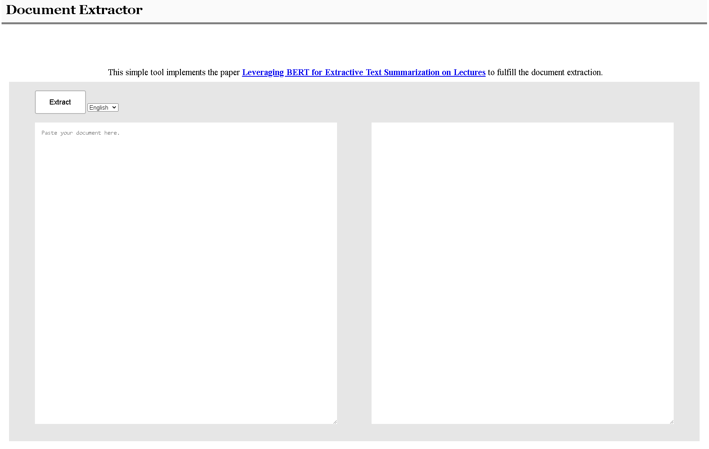
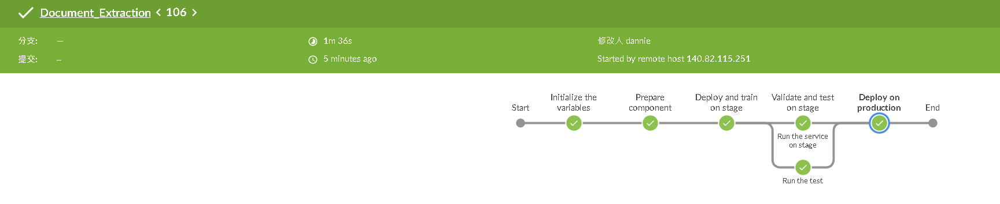

# Document Extraction

## How to use
### Run the service
- `python server/app.py`
### Access the service
- `http://localhost:5000/`

## Web UI

## Run the test
### Run the unit test on server side
- `python -m unittest server/test/server_test.py`
### Run the unit test on ui side
- `python -m unittest server/test/ui_test.py`

## Run the CI/CD
### Run ngrok
- `ngrok http 8080`
### Let Jenkins connect to Github
- Copy the url of the ngrok to the **Setting/Webhooks** as the format `https://"Jenkins user ID":"Jenkins user token"@"Jenkins url"/job/"app name"/build?token="app token on Jenkins"`
### Deploy on AWS EC2
Once the pipeline triggered by **merge request** passes the test, it will deploy the service to AWS EC2 at the stage **Deploy on production**.
- Check the stack status `aws cloudformation describe-stacks`
- Remove the launching instance `aws cloudformation delete-stack --stack-name exampleStack`
### Pipeline

## Reference 
[Leveraging BERT for Extractive Text Summarization on Lectures](https://arxiv.org/abs/1906.04165)
